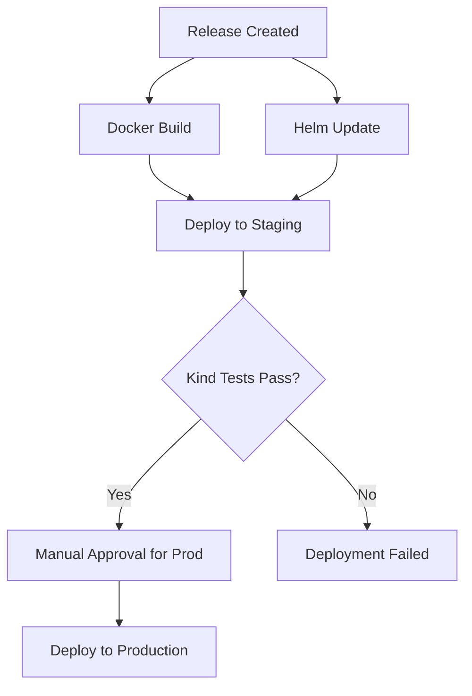

# Environment Configuration Guide

This project uses GitHub Environments for deployment stages. You need to set up these environments in your GitHub repository settings.

## Setting up Environments

1. Go to your GitHub repository
2. Click on **Settings** tab
3. Click on **Environments** in the left sidebar
4. Click **New environment**

### Environments to Create:

#### 🧪 **staging**
- **Name**: `staging`
- **Protection Rules**: 
  - ✅ Required reviewers: 0 (for automatic deployment)
  - ✅ Wait timer: 0 minutes
- **Environment secrets**: None required for Kind testing
- **Environment variables**: None required

#### 🚀 **production**
- **Name**: `production`
- **Protection Rules**:
  - ✅ Required reviewers: 1-2 (for manual approval)
  - ✅ Wait timer: 5 minutes (optional cooling period)
  - ✅ Restrict pushes to protected branches: `main`
- **Environment secrets**: Add production deployment credentials
- **Environment variables**: Production-specific config

## Environment Usage

### Staging
- Automatically deploys after successful tests
- Uses Kind cluster for integration testing
- No manual approval required
- Tests the complete deployment flow

### Production
- Requires manual approval
- Only deployable from `main` branch
- Uses real production infrastructure
- Includes additional safety checks

## Deployment Flow

## Manual Testing

You can manually trigger deployments using the "Test Complete Flow" workflow:

1. Go to **Actions** tab
2. Click **Test Complete Flow**
3. Click **Run workflow**
4. Enter version (e.g., `1.0.0-test`)
5. Select environment (`staging` or `production`)

This will run:
1. ✅ CI tests
2. 🐳 Docker build
3. ⚓ Helm chart update
4. 🧪 Kind cluster testing
5. 🚀 Environment deployment
