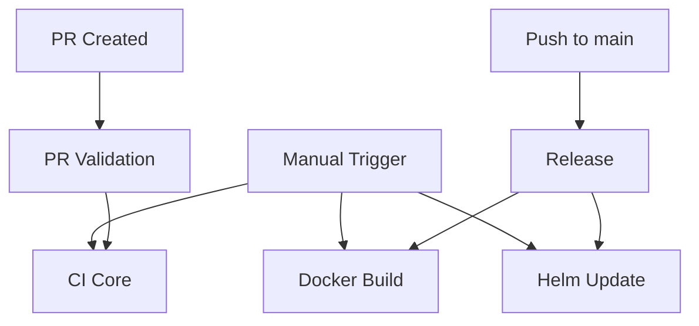

# GitHub Actions Workflows

This project uses a modular workflow approach for better maintainability and parallel execution.

## Workflow Structure

### 🔧 **Core CI** (`ci-core.yaml`)
**Triggers:** PR, Push, Repository Dispatch, Manual
- **Build**: Install dependencies, smoke tests
- **Test**: Unit tests, coverage reporting, threshold enforcement
- **Lint**: Code linting with Super-Linter
- **Helm Lint**: Validates Helm chart syntax

### 🚀 **Release** (`release.yaml`)
**Triggers:** Push to `main` branch
- **Semantic Release**: Automated versioning and changelog
- **Triggers**: Dispatches Docker build and Helm update events
- **Outputs**: New release version for downstream workflows

### 🐳 **Docker** (`docker.yaml`)
**Triggers:** Repository dispatch from release, Manual
- **Dynamic Image Building**: Uses package.json name for image tags
- **Multi-tag Strategy**: version, SHA, latest
- **GHCR Publishing**: Pushes to GitHub Container Registry

### ⚓ **Helm** (`helm.yaml`)
**Triggers:** Repository dispatch from release, Manual
- **Chart Updates**: Bumps version in Chart.yaml and values.yaml
- **Dynamic Packaging**: Uses project name from package.json
- **Chart Publishing**: Pushes to OCI registry (GHCR)

### ✅ **PR Validation** (`pr-validation.yaml`)
**Triggers:** Pull requests
- **Validation Gateway**: Ensures PRs pass CI before merge
- **Async Execution**: Triggers CI-core and waits for completion

## Workflow Flow

## Benefits

- ✅ **Modular**: Each workflow has a single responsibility
- ✅ **Parallel**: Docker and Helm operations run concurrently
- ✅ **Reusable**: Workflows can be triggered manually or by dispatch
- ✅ **Dynamic**: All project names and paths are auto-detected
- ✅ **Maintainable**: Easier to debug and modify individual components
- ✅ **Efficient**: Only runs necessary jobs based on trigger

## Manual Execution

You can manually trigger workflows from the GitHub Actions tab:

- **CI Core**: Test your code changes
- **Docker**: Build and push container images
- **Helm**: Update and publish Helm charts

## Configuration

All workflows use dynamic configuration from:
- `package.json` - Project name and version
- `GITHUB_REPOSITORY` - Repository owner and name
- Environment variables for Node.js version and coverage thresholds
